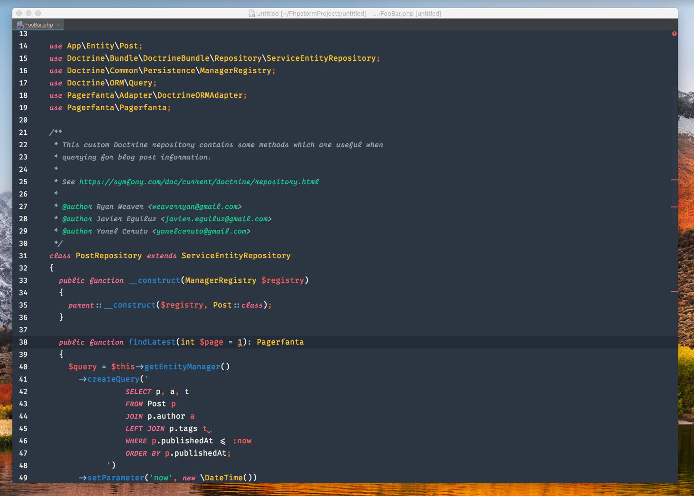

# VSCode-Chester
A Chester syntax for Intellij and tmTheme editors inspired by the [VSCode Chester Atom theme](https://github.com/ceckenrode/vscode-chester-atom) and optimized for italic fonts such as Operator Mono.

