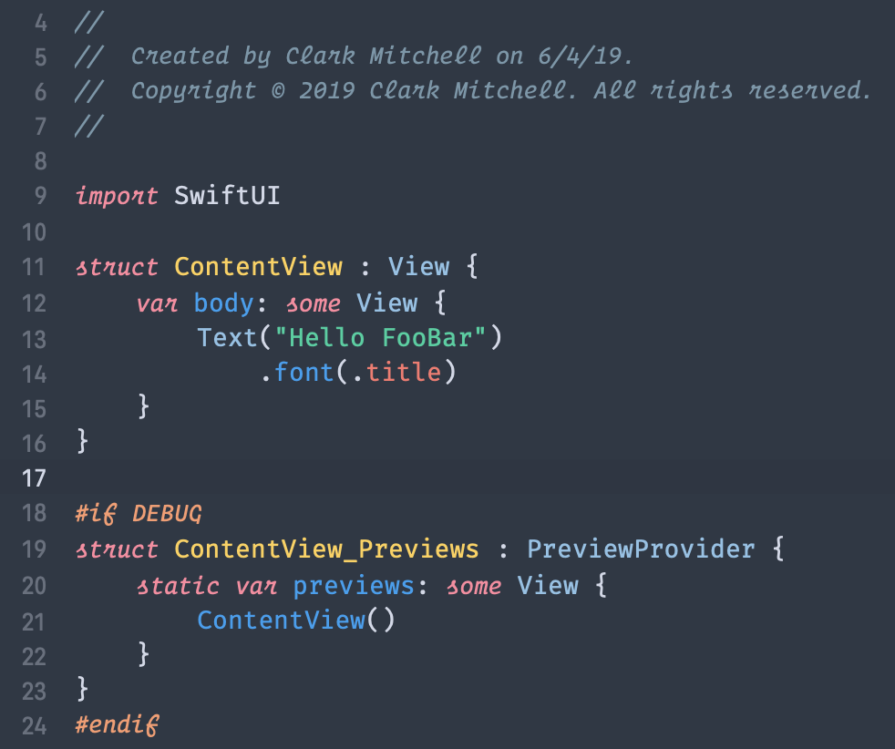
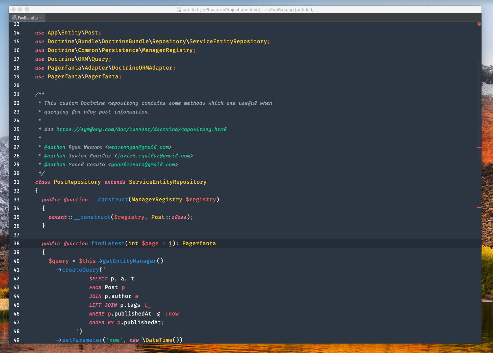
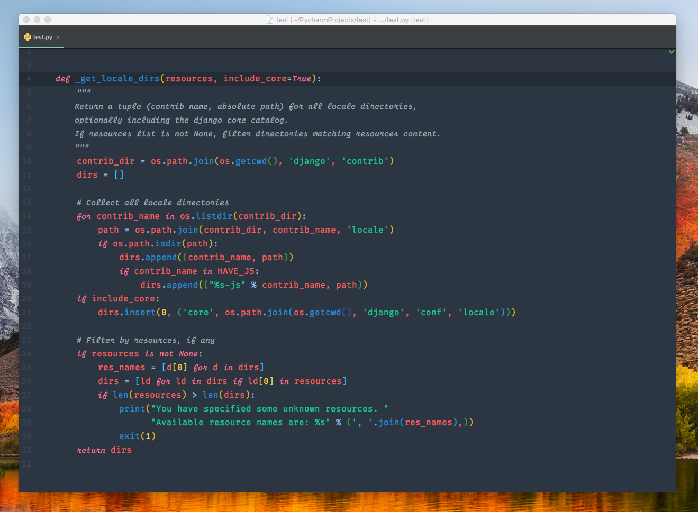

# Chester
A Chester syntax color theme for Intellij, tmTheme editors, RStudio, and Xcode inspired by the [VSCode Chester Atom theme](https://github.com/ceckenrode/vscode-chester-atom) and optimized for italic fonts such as Operator Mono.

## Swift

## PHP

## Python

## R

